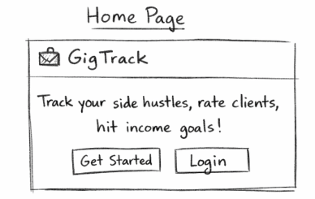
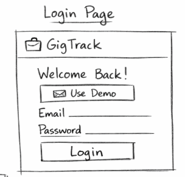
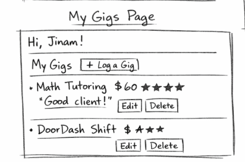
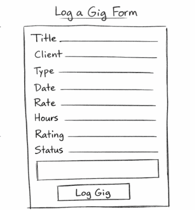
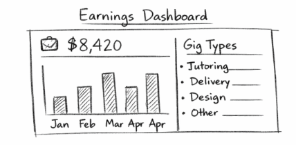
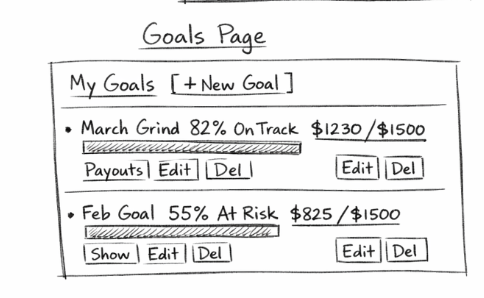

# 💼 GigTrack - Design Document

### Hustle Tracker & Earnings Dashboard

**Team:** Jinam Shah · Sanket Kothari
**Course:** [Web Development Online — Spring 2026](https://johnguerra.co/classes/webDevelopment_online_spring_2026/)
**Instructor:** John Alexis Guerra Gomez

---

## 1. Project Description

Students juggle more side hustles than ever — tutoring, DoorDash, freelance
design, retail shifts, and campus jobs — but have no single place to see what
they actually earned, which clients were worth it, and whether they are hitting
their monthly income target.

**GigTrack** is a personal side hustle tracker where users log every gig, rate
their clients, and track earnings on a visual dashboard. A separate goals module
lets users set monthly income targets, log payouts as received or pending, and
see a color-coded health status at a glance.

Each module works independently and together they form a complete earnings
dashboard for the gig economy.

### Tech Stack

| Layer          | Technology                                    |
| -------------- | --------------------------------------------- |
| Frontend       | React 19 + Vite + React Bootstrap 5           |
| Routing        | React Router v7                               |
| Backend        | Node.js + Express (ES Modules)                |
| Database       | MongoDB (native Node.js driver — no Mongoose) |
| Authentication | Passport.js (LocalStrategy) + bcrypt          |
| Sessions       | express-session + connect-mongo               |

> This project intentionally does **not** use Axios, Mongoose, or any CORS
> library as per course requirements.

---

## 2. User Personas

### 🎓 Persona 1 — The Multi-Hustle Student (Caleb)

| Attribute        | Detail                                                                             |
| ---------------- | ---------------------------------------------------------------------------------- |
| **Age**          | 21                                                                                 |
| **Occupation**   | Undergraduate student                                                              |
| **Side Hustles** | Tutoring, library shifts, Fiverr freelance work                                    |
| **Goal**         | One place to log all income streams and see a real monthly total                   |
| **Pain Point**   | Using separate spreadsheets and invoicing tools feels like too much overhead       |
| **Quote**        | _"I just want to know how much I made this month without building a spreadsheet."_ |

**How GigTrack helps Caleb:**
Caleb logs each gig as it happens — tutoring session on Monday, Fiverr logo
job on Wednesday, library shift on Friday. The dashboard shows him his real
monthly total across all sources in one view.

---

### 🚗 Persona 2 — The Gig Economy Regular (Chet)

| Attribute        | Detail                                                                                  |
| ---------------- | --------------------------------------------------------------------------------------- |
| **Age**          | 24                                                                                      |
| **Occupation**   | Part-time worker + gig driver                                                           |
| **Side Hustles** | DoorDash, retail shifts                                                                 |
| **Goal**         | Compare hourly rate across gig types, find most profitable month                        |
| **Pain Point**   | Has no way to compare earnings across gig types or see trends                           |
| **Quote**        | _"Is DoorDash actually worth it compared to my retail shifts? I genuinely don't know."_ |

**How GigTrack helps Chet:**
Chet logs every DoorDash shift and retail day with hours and rate. The
earnings dashboard breaks down income by gig type so he can instantly see
which type of work earns more per hour.

---

### 💰 Persona 3 — The Goal-Driven Saver (Scarlet)

| Attribute        | Detail                                                                           |
| ---------------- | -------------------------------------------------------------------------------- |
| **Age**          | 22                                                                               |
| **Occupation**   | Graduate student                                                                 |
| **Side Hustles** | Freelance design, occasional event photography                                   |
| **Goal**         | Hit a monthly income target to save for a specific purchase                      |
| **Pain Point**   | Tracking whether she's on pace requires mental math on scattered receipts        |
| **Quote**        | _"I don't need raw numbers — I need to know if I'm on track or falling behind."_ |

**How GigTrack helps Scarlet:**
Scarlet sets a monthly income goal of $1,200. As she logs payouts, the goal
card shows her a green On Track badge when she hits 80%, an amber At Risk
badge between 50–80%, and a red Missed badge if she falls short. No math
required.

---

## 3. User Stories

### Jinam Shah — Gig Entries & Earnings Dashboard

_(Collections: `users`, `gigs`)_

| #   | User Story                                                                                                                                                                                                | Implemented |
| --- | --------------------------------------------------------------------------------------------------------------------------------------------------------------------------------------------------------- | ----------- |
| 1   | As a **new user**, I want to register with a name, email, and password so my gig data is tied to my account.                                                                                              | ✅          |
| 2   | As a **returning user**, I want to log in and log out so my dashboard is private.                                                                                                                         | ✅          |
| 3   | As a **user**, I want to log a gig with a title, client name, gig type (tutoring / delivery / design / retail / other), date, hours worked, and rate (hourly or flat) so I have a full record of my work. | ✅          |
| 4   | As a **user**, I want to rate my client on a 1–5 scale and add a short note so I remember who is worth working with again.                                                                                | ✅          |
| 5   | As a **user**, I want to edit or delete a gig entry so I can correct mistakes or remove cancelled work.                                                                                                   | ✅          |
| 6   | As a **user**, I want to filter my gigs by type, client, and date range so I can find specific entries quickly.                                                                                           | ✅          |
| 7   | As a **user**, I want a visual earnings dashboard showing monthly totals and a breakdown by gig type so I can see where my money comes from.                                                              | ✅          |

### Sanket Kothari — Income Goals & Payout Tracking

_(Collection: `goals`)_

| #   | User Story                                                                                                                                                                                    | Implemented |
| --- | --------------------------------------------------------------------------------------------------------------------------------------------------------------------------------------------- | ----------- |
| 1   | As a **user**, I want to create a monthly income goal with a target amount, month, and label so I have something concrete to work toward.                                                     | ✅          |
| 2   | As a **user**, I want to edit or delete a goal so I can adjust targets as my plans change.                                                                                                    | ✅          |
| 3   | As a **user**, I want to log a payout against a goal with an amount, source, date, and status (received / pending) so I know what has landed in my account versus what I am still owed.       | ✅          |
| 4   | As a **user**, I want to edit or delete a payout entry so I can correct mistakes in my ledger.                                                                                                | ✅          |
| 5   | As a **user**, I want each goal to show a color-coded health status — on track (green), at risk (amber), or missed (red) — based on received amount versus target and days left in the month. | ✅          |
| 6   | As a **user**, I want to filter goals by month and health status so I can quickly find goals that need attention.                                                                             | ✅          |
| 7   | As a **user**, I want to see how many months in a row I have hit my income goal (my goal streak) so staying consistent feels rewarding.                                                       | ✅          |

---

## 4. Design Mockups

### 4.1 — Home Page

### 4.2 — Login Page

### 4.3 — My Gigs Page

### 4.4 — Log a Gig Form

### 4.5 — Earnings Dashboard

### 4.6 — Goals Page

### 4.7 — Goal Health Status Logic

Received / Target Ratio:

≥ 80% → 🟢 ON TRACK (green badge)
50–79% → 🟡 AT RISK (amber badge)
< 50% → 🔴 MISSED (red badge)
Past month end + < 100% → 🔴 MISSED

Progress Bar Colors:
On Track → green gradient (#2ecc71 → #27ae60)
At Risk → amber gradient (#f39c12 → #e67e22)
Missed → red gradient (#e74c3c → #c0392b)

---

## 5. Technical Independence

Both modules are **fully functional independently** of each other:

### Jinam Shah — Gigs & Auth Module

| Item         | Detail                                                                            |
| ------------ | --------------------------------------------------------------------------------- |
| Collections  | `users`, `gigs`                                                                   |
| Auth         | Register, Login, Logout via Passport.js LocalStrategy                             |
| CRUD         | Full Create, Read, Update, Delete on gigs                                         |
| Filtering    | By gig type, client name, start date, end date                                    |
| Dashboard    | Server-side aggregation of monthly totals + by gig type                           |
| Components   | `LoginForm`, `RegisterForm`, `GigList`, `GigForm`, `GigCard`, `EarningsDashboard` |
| Independence | Fully works without goals system                                                  |

### Sanket Kothari — Goals & Payouts Module

| Item         | Detail                                                                        |
| ------------ | ----------------------------------------------------------------------------- |
| Collection   | `goals` (with embedded `payouts` array)                                       |
| CRUD         | Full Create, Read, Update, Delete on goals AND payouts                        |
| Health Logic | Computed server-side based on received/target ratio + days left               |
| Streak       | Consecutive months hitting income target                                      |
| Filtering    | By month and health status                                                    |
| Components   | `GoalList`, `GoalForm`, `GoalCard`, `PayoutForm`, `PayoutList`, `StreakBadge` |
| Independence | Fully works without gigs system                                               |

---
